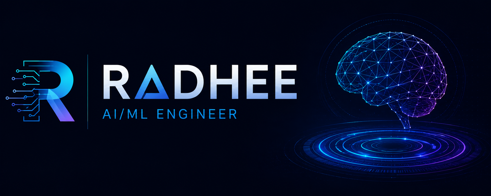
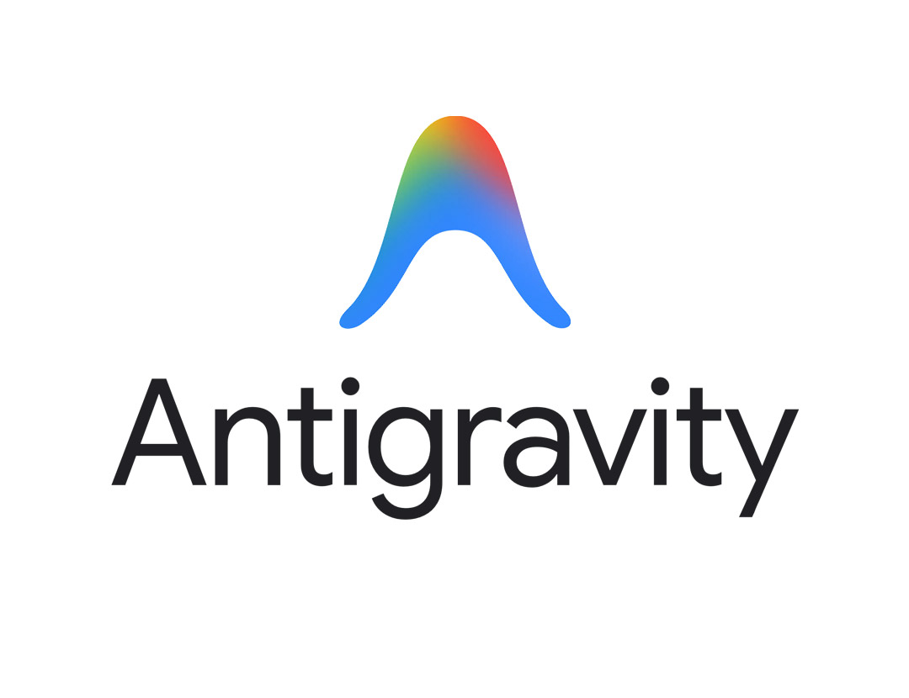
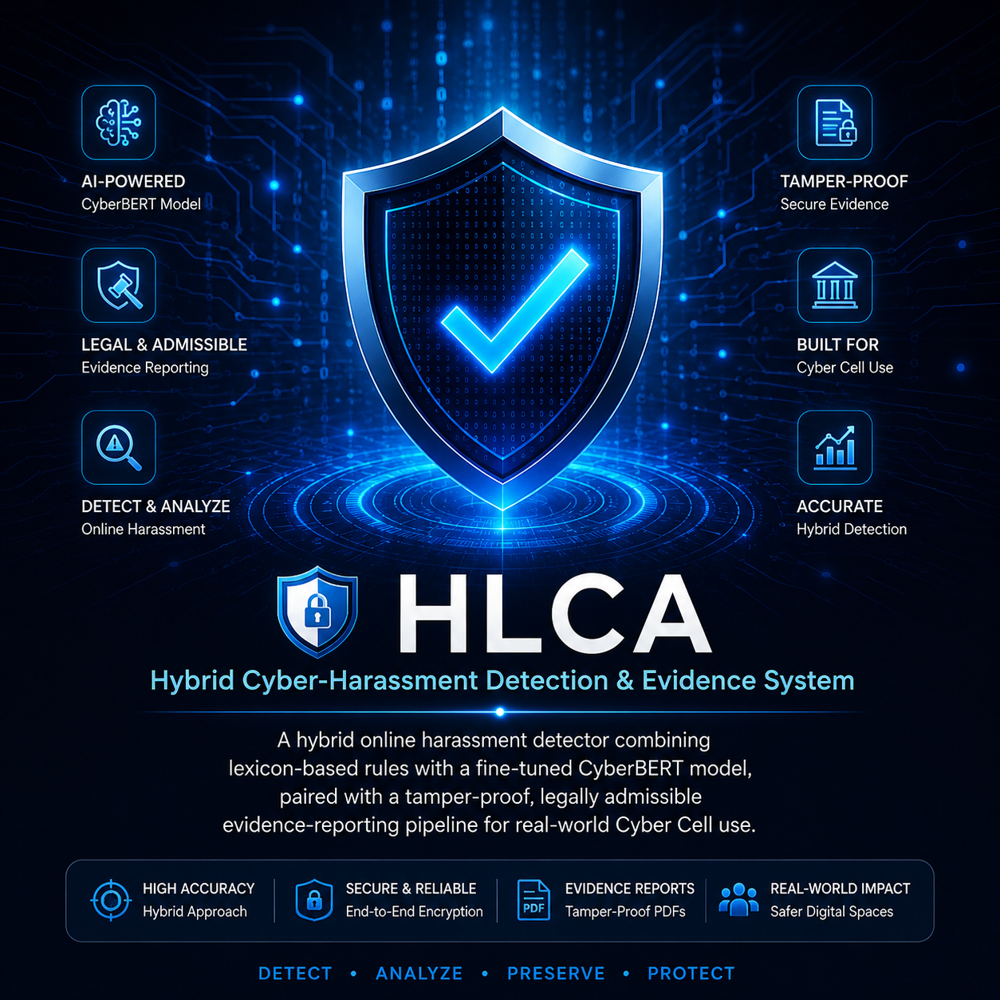
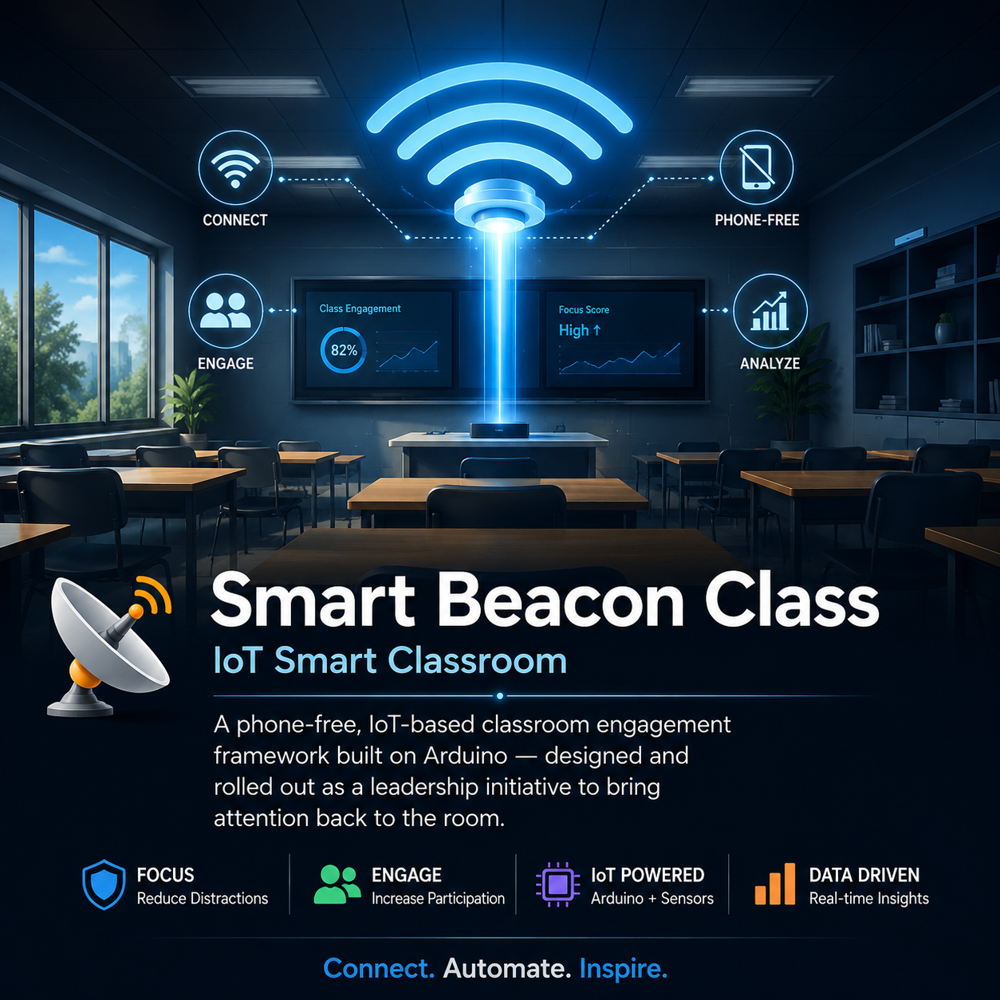
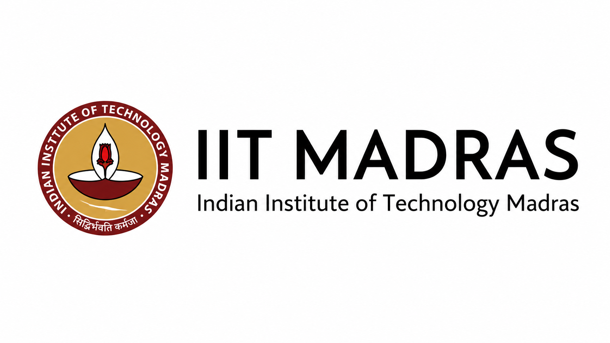
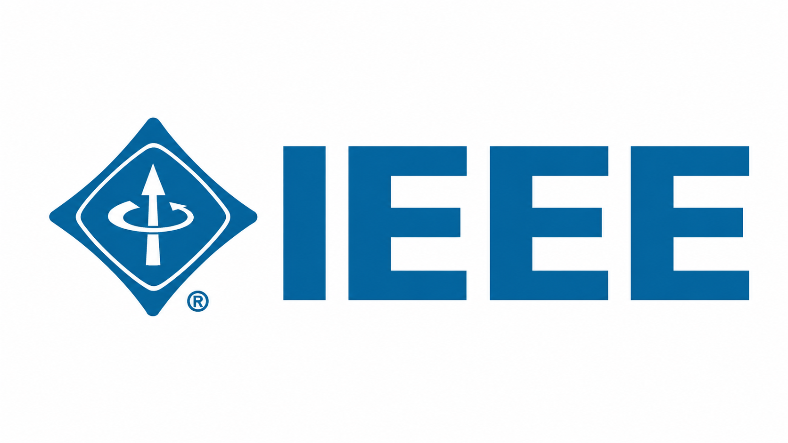

<!-- ===================== HEADER BANNER ===================== -->

<!-- ===================== TERMINAL INTRO ===================== -->

<table>
<tr><td>

&nbsp;&nbsp;🤖&nbsp;<code>AI_ENGINE</code>&nbsp;&nbsp;

</td></tr>
</table>

<h2 align="center">⚡My Reach</h2>

## 👤 About Me

<table align="center" border="0">
<tr>
<td width="20%" valign="top" align="center">

**🎓 Education**

</td>
<td width="20%" valign="top" align="center">

**📍 Location**

</td>
<td width="20%" valign="top" align="center">

**💼 Role**

</td>
<td width="20%" valign="top" align="center">

**🎯 Status**

</td>
<td width="20%" valign="top" align="center">

**🧠 Focus Areas**

</td>
</tr>
<tr>
<td colspan="5" align="center">

**🌱 Currently Learning**

</td>
</tr>
</table>

## 🛠️ Tech Stack

<table>
<tr>
<td align="center" width="110">
 
<b>Python</b>
</td>
<td align="center" width="110">
 
<b>TensorFlow</b>
</td>
<td align="center" width="110">
 
<b>PyTorch</b>
</td>
<td align="center" width="110">
 
<b>Scikit-learn</b>
</td>
<td align="center" width="110">
 
<b>MySQL</b>
</td>
</tr>
<tr>
<td align="center" width="110">
 
<b>Git</b>
</td>
<td align="center" width="110">
 
<b>GitHub</b>
</td>
<td align="center" width="110">
 
<b>VS Code</b>
</td>
<td align="center" width="110">
 
<b>Anaconda</b>
</td>
<td align="center" width="110">
 
<b>NumPy</b>
</td>
</tr>
<tr>
<td align="center" width="110">
 
<b>Pandas</b>
</td>
<td align="center" width="110">
 
<b>BERT</b>
</td>
<td align="center" width="110">
 
<b>REST API</b>
</td>
<td align="center" width="110">
 
<b>Claude</b>
</td>
<td align="center" width="110">
 
<b>Antigravity</b>
</td>
</tr>
</table>

---

## 🚀 Featured Projects

<table align="center">
<tr>
<td align="center" width="33%">
  
<b>🛡️ HLCA</b> 
AI-powered PDF Verification  

</td>
<td align="center" width="33%">
  
<b>🤖 Study Buddy</b> 
AI Study Companion  

</td>
<td align="center" width="33%">
  
<b>📡 Smart Beacon Class</b> 
IoT Smart Classroom  

</td>
</tr>
</table>

## 🏅 Certifications

<table>
<tr>
<td align="center" bgcolor="#8B0000" width="320">
 
  
<b style="font-size:16px;">🏛️ IIT Madras</b> 
<b>AI/ML with Python</b> 

  
</td>
<td width="20"></td>
<td align="center" bgcolor="#3d1a78" width="320">
 
  
<b style="font-size:16px;">🏛️ IEEE & NIT Karaikal</b> 
<b>AI/ML Techniques</b> 

  
</td>
</tr>
</table>

## 📊 GitHub Analytics

  
  

Contribution Graph

  

<table align="center">
<tr>
<td align="center" width="50%" valign="top">
<b>🤝 Open to Collaborate</b>  

 

</td>
<td align="center" width="50%" valign="top">
<b>🔗 Let's Connect</b>  

 

</td>
</tr>
</table>

### *"The best way to predict the future is to invent it."*
**— Alan Kay**

